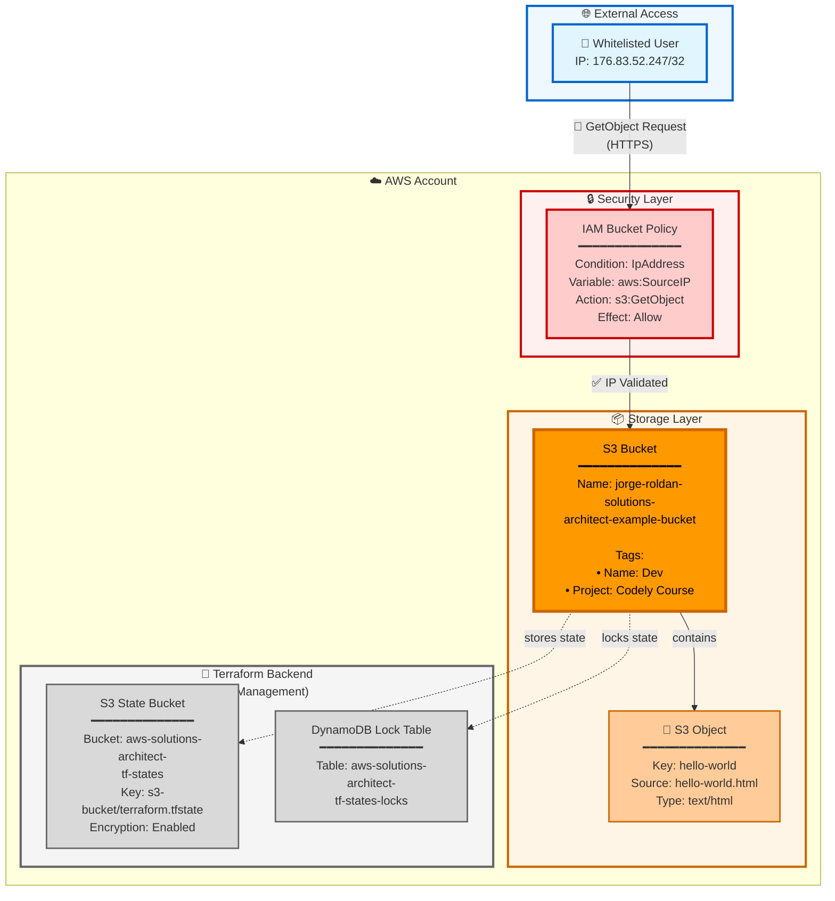

# S3 Bucket Architecture

## Architecture Diagram



## Architecture Overview

This infrastructure demonstrates a simple S3 bucket with IP-based access control and remote state management.

### Components

#### 1. External Access Layer
- **User**: Whitelisted IP address (176.83.52.247/32)
- **Access Method**: HTTPS requests to S3
- **Permission**: Read-only (`s3:GetObject`)

#### 2. Security Layer
- **S3 Bucket Policy**: IAM policy attached to bucket
- **Condition**: Source IP must match whitelist
- **Principal**: `AWS: *` (public with IP restriction)
- **Action**: `s3:GetObject` only

#### 3. Storage Layer
- **S3 Bucket**: `jorge-roldan-solutions-architect-example-bucket`
  - Tags: `Name=Dev`, `Project=Codely Course`
- **Object**: `hello-world.html`
  - Key: `hello-world`
  - Content-Type: `text/html`

#### 4. Backend State Management
- **S3 State Bucket**: `aws-solutions-architect-tf-states`
  - Stores Terraform state files
  - State file: `s3-bucket/terraform.tfstate`
  - Encryption enabled
- **DynamoDB Lock Table**: `aws-solutions-architect-tf-states-locks`
  - Prevents concurrent state modifications
  - Ensures state consistency

## Request Flow

1. User from whitelisted IP (176.83.52.247/32) sends GetObject request
2. S3 Bucket Policy evaluates the request
3. Policy checks `aws:SourceIP` condition
4. If IP matches whitelist → Access granted ✅
5. If IP doesn't match → Access denied ❌
6. User retrieves `hello-world.html` object

## Security Model

**Access Control:**
- IP-based restriction (not authentication-based)
- Only specific CIDR block allowed: `176.83.52.247/32`
- Public bucket with restricted access via bucket policy

**Limitations:**
- No user authentication required
- IP spoofing possible (use VPN/proxy for additional security)
- Suitable for development/learning environments

**Best Practices Applied:**
- Read-only access (principle of least privilege)
- Explicit allow policy
- Remote state with locking

## Terraform Configuration

### Module Structure
```
s3-bucket/
├── main.tf              # Root configuration
├── provider.tf          # AWS/LocalStack provider
├── backend.tf           # Remote state configuration
├── variables.tf         # Input variables
├── terraform.tfvars     # Variable values
└── s3/
    ├── main.tf         # S3 module resources
    └── variables.tf    # Module variables
```

### Key Resources
- `aws_s3_bucket` - Main bucket
- `aws_s3_object` - hello-world.html file
- `aws_s3_bucket_policy` - IP whitelist policy
- `data.aws_iam_policy_document` - Policy definition

## LocalStack Configuration

When running locally with LocalStack:
- **Endpoint**: `http://s3.localhost.localstack.cloud:4566`
- **Region**: `us-east-1`
- **Credentials**: access_key=test, secret_key=test
- **Services**: S3, DynamoDB, IAM

## Related Files

- [Main Configuration](./main.tf)
- [S3 Module](./s3/main.tf)
- [Backend Config](./backend.tf)
- [Provider Setup](./provider.tf)
